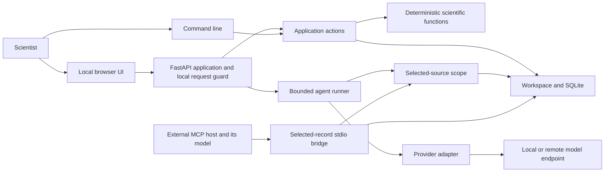

# Architecture and extension boundaries

Scientist OS is a single-user, local-first research workspace with a Python core, a packaged browser interface and a replaceable model adapter. Its central separation is between **registered evidence**, **deterministic computation**, **model proposals** and **human review**. A language model does not own the database, approve a scientific conclusion or execute arbitrary analysis code.

## Why this delivery model

| Form | Beta decision and rationale |
| --- | --- |
| Installable Python application with local web UI | Implemented. One core supports browser, command line and MCP while keeping records on the scientist's computer. A browser interface avoids a separate desktop widget stack and supports inspection of records, figures and traces. |
| Repository installation | Implemented. Researchers and developers can inspect the harness, pin the environment, reproduce tests and modify it under Apache-2.0. The installable package is the product; a repository of instructions alone would not enforce its record and runtime contracts. |
| Publicly hosted web application | Not a beta deployment target. Hosting real research would require identity, tenant isolation, authorization, secret management, retention policies, operational backups and a reviewed model-disclosure design. Opening the local port to the internet does not supply these. |
| Packaged executable | A possible later distribution wrapper. It may simplify installation, but adds operating-system builds, signing, updates and packaging checks. It should wrap the same core rather than fork the scientific workflow. No executable release is claimed here. |
| External assistant through MCP | Implemented as an optional stdio bridge. The external host brings its model; Scientist OS supplies selected evidence and a proposal contract. Host behaviour outside that bridge remains outside the product's control. |

There is no requirement to use a particular model vendor. Protocol compatibility and quality still need checking for the chosen endpoint. Local storage and a loopback API reduce deployment complexity; they do not by themselves guarantee that a local model proxy or external assistant never sends data elsewhere.

## Components and responsibilities

| Module | Owns | Boundary |
| --- | --- | --- |
| `workspace.py` | Typed record validation, optimistic revisions, acyclic provenance, content/state integrity, review invalidation, run/event persistence and export | No model, network, source-path traversal or arbitrary scientific execution |
| `science.py` | Strict CSV summaries, independent study meta-analysis, escaped SVGs and metadata screening | Pure functions; no database, model, files or network |
| `service.py` | User-directed numerical analysis, lineage registration, figure creation/regeneration, draft saving and Markdown handoff | Distinguishes human application actions from model tools; does not make multi-record workflows one implicit scientific approval |
| `studio.py` | Manuscript sections, reference validation, selected-passage proposals/application, persistent research discussions | Exact revisions and selected context; models cannot apply or approve edits |
| `publishing.py` | Original document registration, safe text extraction, exact excerpts, presentation records, PPTX/DOCX/HTML generation | No source URLs are followed; original bytes are content-addressed; export checks current provenance |
| `literature.py` | Explicit public bibliographic queries to the fixed Crossref works endpoint | No workspace object or implicit project disclosure; results are metadata, not full-text review |
| `authoring_api.py` | Strict local HTTP authoring contracts | Shared domain modules, existing origin/host/CSRF guard and bounded uploads |
| `agent.py` | Selected-source snapshots, limits, tool allowlist, exact citation validation, bounded completion loop and trace | Models can search/read selected records and finish a proposal only |
| `providers.py` | Deterministic demo and bounded OpenAI-compatible HTTP adapter | Translates model I/O; receives no workspace object or filesystem authority |
| `mcp_server.py` | Fixed-selection stdio tools, instruction packet and proposal submission | Host supplies inference; the bridge does not certify the host's other actions |
| `app.py` and `static/` | Local API, browser forms, record review, lifecycle decisions, plots and exports | Single-user loopback service, not an authenticated research platform |
| `cli.py` | Workspace initialization, teaching examples, local serving, audit and export | Uses the same workspace/application contracts |
| `workflows.py` | Reviewable lifecycle stages and checkpoints | Human decision support; stage labels do not enforce scientific completeness |

The preserved private `.upstream/Cell-iSCAT-Writing` clone is a read-only provenance reference during development. It is not imported at runtime, packaged, served to a model or included in a product release. [Source audit](SOURCE_AUDIT.md) describes the extraction and feature boundaries.

## Data model and dependency semantics

Each workspace directory contains `scientist-os.sqlite3`. Schema version 1 stores three main tables: current `records`, append-only `events`, and immutable `runs`. A record has a stable generated ID, one allowed kind, title, UTF-8 content, bounded JSON metadata, upstream links, monotonically increasing revision, content SHA-256, review status and timestamps. The core additionally checks a digest of the complete stored record state.

Kinds represent sources, datasets, materials, protocols, processed data, analyses, outputs, claims, terms, experiments, manuscripts, software, decisions, notes, references, documents, presentations and discussions. These additions preserve schema version 1 and existing record histories. Scientific metadata is explicit: authority, rights, units, independence, protocol/code revision, exclusions and model disclosure are recorded rather than inferred from filenames or customary practice.

Links are **directed scientific dependencies**. They reference existing IDs and cannot point to self or form cycles. Citation references and `input_revisions` also contribute dependencies. This differs from an unconstrained knowledge graph: bidirectional convenience links would create ambiguous invalidation loops. Render reverse relationships by querying dependencies rather than storing a reverse dependency.

Numerical analysis stores the exact input record revision/hash, parameters, deterministic result and software environment identifiers. A generated figure depends on its analysis revision and underlying source lineage. A full Git hash in a Software record is an explicit version declaration, not proof that the remote commit exists or that the executed working tree matched it.

Raw files remain outside the database. Project-library uploads preserve original bytes in workspace `attachments/<sha256>`, alongside extracted text in a document record. Download and excerpt creation verify attachment bytes; a record content hash identifies extracted UTF-8 text and `attachment_sha256` identifies its original. Arbitrary metadata paths and URLs remain inert during analysis/export. JSON handoffs exclude attachment bytes; back up the entire stopped workspace for restoration.

Manuscripts store stable section UUIDs with text, figure/reference links and a supplementary flag. A revision covers the entire manuscript. Passage offsets use browser UTF-16 code units with exact-text checks and reject split surrogate pairs. A proposal keeps source snapshots and the original manuscript revision; a named human applies it atomically. Applied source dependencies cannot be silently refreshed by later attached-figure saves. Discussions retain turns locally but include only deliberately selected prior turns in model context; their evidence must be reselected and current.

## Transactions, reviews and history

Every core mutation participates in a SQLite write transaction (`BEGIN IMMEDIATE`). The record change, recursive dependent-review invalidations and corresponding events commit together. Expected revisions reject stale edits/reviews. Reads and exports use consistent transactions. SQLite locks coordinate local processes; the design does not provide multi-user permissions or distributed synchronization.

New/edited records are unreviewed. Human approval/rejection records the reviewer and scope in an event and increments the revision. Any upstream change, **including review**, increments affected dependent revisions and returns their review states to unreviewed. Stored citations/input revisions are preserved so staleness remains visible rather than silently rebased.

This means review order matters: review upstream records before deriving work; review an analysis, then regenerate its figure from the current analysis revision; review the figure, then finalize dependent claims/manuscript sections. Regeneration creates a new output record. It does not overwrite the prior artifact or assert that an upstream data change was recomputed. A stale figure request is a conflict requiring regeneration/recomputation, not permission to serve a changed image under old provenance.

Events form a SHA-256 chain using canonical JSON. SQLite triggers reject event updates/deletes, run updates/deletes and record deletes through normal SQL operations. Runs include configured limits, provider/model identity, source snapshots, tool requests/results, failures and review state. The core verifies persisted integrity and compares records/runs against history.

These controls detect inconsistencies within the trusted local workspace and retain application history. They are **not cryptographic nonrepudiation or an externally anchored audit log**: an administrator with filesystem/database access can alter the database, remove triggers or reconstruct hashes. Reviewer names are not authenticated signatures. Protect the computer and backups using the institution's normal controls; the beta does not supply accounts, encryption at rest, WORM storage or regulated electronic signatures.

`Workspace.transaction()` groups core operations on one workspace instance in the current thread. Nested operations share the connection; any nested validation/storage failure aborts the whole unit, including when calling code catches the original exception. Analysis and figure registration use this boundary so both records and their events commit together. The service checks that rendering is possible before persistent mutation. A transaction must not contain network requests, awaited work or operations on another thread. External instrument, file, model and Git actions are not made atomic by a database transaction; a future workflow combining them needs explicit failure/recovery semantics.

## Agent runtime and model neutrality

The runtime calls a provider with `name`, boolean `is_remote`, optional model identity, and `complete(messages, tools) -> dict`. An adapter returns an OpenAI-style assistant message with optional function tool calls. The bundled adapter uses Chat Completions-compatible local loopback or HTTPS endpoints; other vendor protocols can implement the same Python interface. [Model connections](PROVIDERS.md) provides the concrete contract and transport limits.

Every run begins with a fresh explicit question, task, style and source selection. `SourceScope` snapshots selected record content, revision/hash and permission, then verifies freshness before each relevant disclosure/tool action. Retrieval is bounded lexical search with exact excerpts over selected IDs. The runtime has no unbounded browse, shell, filesystem-write, approval or publication tool.

The tool set is deliberately narrow:

1. `search_records(query)` finds text within the selection.
2. `read_record(record_id)` reads a selected record.
3. `finish(answer, citations)` submits a proposal with exact nonempty quotes, selected IDs and matching source hashes.

The runner caps model steps, source counts/lengths, total context, responses, tool calls, answers and quotations. It rejects malformed/duplicate-key JSON and invalid tool schemas, traces failed calls, and permits corrections only within the remaining budget. A changed source, provider failure or exhausted bound preserves a failed run. A finished proposal is `needs_review`; no exact citations means it is explicitly unsupported. Exact quotations are integrity evidence, not semantic entailment.

Tasks such as experiment, manuscript, terminology, synthesis, journals and figures guide the proposal prompt. They do not expand capabilities. Actual CSV/meta calculations and SVG rendering are separate explicit application actions. This avoids a model reporting a numerical analysis that it never executed.

For a remote endpoint, every selected record must declare `external_allowed: true`. The model receives selected content/title and the user's question/style plus accumulated tool observations; unrelated records, secrets and prior runs are not automatically included. Disclosure is not the same as scientific approval or rights clearance. A later permission revocation stops subsequent calls but cannot recall data already transmitted.

Custom adapters run as trusted Python code. Do not let an adapter receive the whole workspace, reclassify remote inference as local, smuggle additional context, or log credentials. Model-neutral architecture is an extension contract, not a claim that every model behaves safely or has equivalent scientific quality.

## MCP: share the harness with another assistant

The optional MCP server uses the maintained SDK over stdio. The human starts it with a workspace and explicit repeated `--source` IDs. Tools expose a task packet, selected-record search/read and proposal submission. They cannot expand the selection, change disclosure, modify scientific records or approve output. Proposal submission validates quotes and stores a run requiring human review.

The default treats all bridge output as external disclosure because the bridge cannot inspect where the host's inference runs. `--local-client` is a deliberate operator assertion that both the host and its inference remain local, not a security sandbox. Source changes require a fresh bridge selection. The session also has an operation cap.

Only bridge activity is observable. The MCP host may have other filesystem/network tools, hidden context, its own memory and its own model loop. Scientist OS cannot reconstruct those actions or measure its unreported token use. Configure those capabilities in the host separately. A submitted MCP proposal being well-formed does not prove the host followed every instruction.

## Local web trust boundary

The CLI serves on loopback. The application checks local Host values, same-origin access and a per-process token on writes, limits request bodies and sends a restrictive content-security policy. Imported text is escaped in the UI. Generated figures are produced by the deterministic renderer, not by rendering arbitrary imported SVG/HTML as trusted active content. These are local web protections, not login or tenant authorization.

The browser displays all records in the selected local workspace because the user is its trusted operator. Model source selection is a separate disclosure boundary. An untrusted local process or privileged host can access the local application/database; the app does not sandbox it. A future hosted deployment must not inherit this single-user trust assumption unchanged.

Secrets are configured in the server environment, not browser forms or research records. Adapters use bounded transport and redacted error/run handling. Redaction is a secondary safeguard; credentials must not be imported as scientific content. Exports contain full registered content and potentially historical sensitive text in events/traces, so sharing an export is a separate user decision.

## Extension seams and required gates

| Extension | Where to add it | Required evidence before release |
| --- | --- | --- |
| New model protocol | Provider adapter using the runner | Mock transport/schema failures; credential redaction; selected-context/disclosure boundaries; real endpoint compatibility separately from answer-quality evaluation |
| New deterministic method | Pure typed function alongside scientific tools; explicit service/UI action | Frozen mathematical fixtures, missingness/nonfinite handling, independence/units assumptions, failure cases and reproducible result schema |
| More lifecycle guidance | Stage definitions and documentation | Clear human checkpoints; no new scientific certification implied by a checked stage |
| New record metadata | Existing bounded JSON metadata with documented meaning | UI round-trip, export preservation and validation of any new reserved fields; do not infer old unknown values |
| PDF/table ingestion | Separate import boundary creating checked/provisional source records | Original-byte preservation, rights/authority, page/region locators, extraction errors and human verification; imported instructions remain untrusted |
| External scientific code execution | A new capability, not an extra prompt | Explicit scope/approval, isolated execution, input/output contracts, resource limits, immutable software/environment identity, artifact hashing and failure lineage |
| Hosted service | New deployment/security architecture | Authentication/authorization, tenant isolation, secrets, quotas, backups/recovery, disclosure/retention policy and operational testing |

Do not silently widen the agent tool set when adding a capability. A tool that writes records, downloads sources, executes code or publishes content changes the authority model and needs a separately reviewed contract. Preserve a human decision point and immutable trace appropriate to the action. Keep actual scientific computation outside free-form model prose.

## Schema evolution, backup and release

The database uses SQLite `user_version`. The beta accepts its known schema and refuses unknown versions or unrecognized nonempty databases. There is no automatic JSON import or schema migration tool. A JSON bundle is a portable evidence handoff; a stopped-workspace directory copy is the current backup/reopen path. External raw sources need their own backups.

Before introducing a migration:

1. Define old/new schemas, scientific meaning changes and supported upgrade paths; increment the version.
2. Require a verified stopped-workspace backup and run migrations on a copy first.
3. Test previous-version fixtures, interruption/rollback behaviour, exact record/run/event preservation and reopen/audit/export.
4. Preserve historical meaning and hashes. Record any required transformations in migration provenance; never rewrite old scientific review as if it applied to new semantics.
5. Refuse unsupported downgrade or unknown-version operations with an actionable error. Publish recovery instructions and actual validation evidence.

Pin dependencies with the committed lockfile and use the same Python core across browser, CLI and MCP. Release checks should inspect package contents to exclude the private source clone, local workspaces, raw research, credentials and caches. The Apache-2.0 product license covers the generic application; it does not relicense source-project research or imported third-party materials.

The current scientific and harness tests use synthetic known-answer fixtures. [Scientific methods](METHODS.md) and the [evaluation protocol](EVALUATION_PROTOCOL.md) distinguish implemented checks from planned real-model assessment and future scientist usability studies. Neither a passing test suite nor a polished UI establishes independent scientific validation or adoption.
